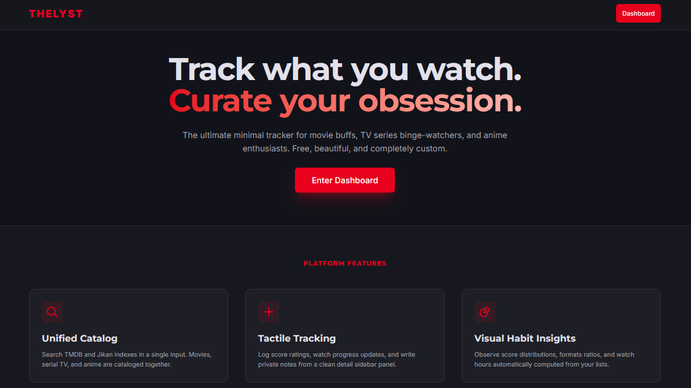

<!-- Improved compatibility of back to top link: See: https://github.com/pull/73 -->
<a name="readme-top"></a>

<!-- PROJECT SHIELDS -->
[![Contributors][contributors-shield]][contributors-url]
[![Forks][forks-shield]][forks-url]
[![Stargazers][stars-shield]][stars-url]
[![Issues][issues-shield]][issues-url]
[![GNU AGPLv3 License][license-shield]][license-url]

<!-- PROJECT LOGO -->
<br />
<div align="center">
  <a href="https://github.com/meleo2125/thelystapp">
    <span style="font-size: 3rem; font-weight: 900; letter-spacing: 0.2em; color: #3b82f6;">🎬 THELYST</span>
  </a>

  <h3 align="center">TheLyst Tracker</h3>

  <p align="center">
    A premium, unified media tracker for movie buffs, TV series binge-watchers, and anime enthusiasts.
    <br />
    <a href="https://github.com/meleo2125/thelystapp"><strong>Explore the docs »</strong></a>
    <br />
    <br />
    <a href="https://thelystapp.vercel.app">View Demo</a>
    ·
    <a href="https://github.com/meleo2125/thelystapp/issues">Report Bug</a>
    ·
    <a href="https://github.com/meleo2125/thelystapp/issues">Request Feature</a>
  </p>
</div>

<!-- TABLE OF CONTENTS -->
<details>
  <summary>Table of Contents</summary>
  <ol>
    <li>
      <a href="#about-the-project">About The Project</a>
      <ul>
        <li><a href="#built-with">Built With</a></li>
      </ul>
    </li>
    <li>
      <a href="#getting-started">Getting Started</a>
      <ul>
        <li><a href="#prerequisites">Prerequisites</a></li>
        <li><a href="#installation">Installation</a></li>
        <li><a href="#firebase-setup">Firebase Setup</a></li>
      </ul>
    </li>
    <li><a href="#usage">Usage & Features</a></li>
    <li><a href="#deployment">Deployment</a></li>
    <li><a href="#roadmap">Roadmap</a></li>
    <li><a href="#contributing">Contributing</a></li>
    <li><a href="#license">License</a></li>
    <li><a href="#contact">Contact</a></li>
    <li><a href="#acknowledgments">Acknowledgments</a></li>
  </ol>
</details>

<!-- ABOUT THE PROJECT -->
## About The Project

[](https://thelystapp.vercel.app)

TheLyst is a sleek, minimal, unified tracking platform. Instead of managing separate trackers for movies, television, and anime, TheLyst aggregates metadata from multiple providers into a single, cohesive experience.

Key highlights:
* **Unified Interface**: One search input to fetch results from TMDB (Movies & TV) and Jikan (Anime/MAL).
* **Tactile Interactions**: Rating scales, episode counts, status logs, and private notes in one clean panel.
* **Custom Lysts**: Curate custom lists, share them, clone others' lists, and upvote/like community selections.
* **Social Connections**: Follow others, write media reviews, and stay updated through a live activity feed.

<p align="right">(<a href="#readme-top">back to top</a>)</p>

### Built With

This project is built using modern full-stack web technologies:

* [![Next][Next.js]][Next-url]
* [![React][React.js]][React-url]
* [![TailwindCSS][Tailwind.shield]][Tailwind-url]
* [![Firebase][Firebase.shield]][Firebase-url]
* [![TypeScript][TypeScript.shield]][TypeScript-url]

<p align="right">(<a href="#readme-top">back to top</a>)</p>

<!-- GETTING STARTED -->
## Getting Started

To set up a local copy of the application, follow these steps.

### Prerequisites

Make sure you have Node.js (v18.x or later) and npm installed.
* npm
  ```sh
  npm install npm@latest -g
  ```

### Installation

1. Get a free TMDB API Key and Bearer Access Token at [TheMovieDB](https://www.themoviedb.org/settings/api).
2. Clone the repository:
   ```sh
   git clone https://github.com/meleo2125/thelystapp.git
   ```
3. Install dependencies:
   ```sh
   npm install
   ```
4. Create a `.env` file in the root directory by copying the template:
   ```sh
   cp .env.example .env
   ```
5. Enter your configuration values in `.env`:
   ```env
   TMDB_API_KEY=your_tmdb_key_here
   ACCESS_TOKEN=your_bearer_token_here
   NEXT_PUBLIC_FIREBASE_API_KEY=your_firebase_api_key
   # ... add remaining Firebase Client and Admin keys
   ```

<p align="right">(<a href="#readme-top">back to top</a>)</p>

### Firebase Setup

The app relies on Firebase Auth and Cloud Firestore.

1. Create a Firebase project in the [Firebase Console](https://console.firebase.google.com/).
2. Enable **Authentication** (Email/Password & Google Sign-In providers).
3. Enable **Cloud Firestore** in test mode or production mode.
4. Deploy security rules and composite indexes using the Firebase CLI:
   ```sh
   # Install Firebase CLI globally if needed
   npm install -g firebase-tools

   # Log in and select project
   firebase login
   firebase use --add

   # Deploy
   firebase deploy --only firestore
   ```

<p align="right">(<a href="#readme-top">back to top</a>)</p>

<!-- USAGE EXAMPLES -->
## Usage & Features

### 🔍 Unified Search
Search for movies, TV series, or anime in a single debounced bar. The application automatically handles Jikan API rate limits (1 req/s) and caches query results.

### 📝 Tactile Tracking Sidebar
Log rating score (1-10 mapped to customizable display preferences like 5-stars), current episode progress, status flags, and write personal comments.

### 👥 Follows & Activity Feed
Check out the social tab to discover what media other users are completing or reviewing, and click to visit their profiles at `/u/[username]`.

### 📊 Habit Heatmaps & Analytics
View score distributions, watchlist category ratios, and completions tracked by month in dynamic charts.

<p align="right">(<a href="#readme-top">back to top</a>)</p>

<!-- DEPLOYMENT -->
## Deployment

### Deploying to Vercel (Recommended)

1. Connect your Github repository to your **Vercel** dashboard.
2. In the project settings, add the environment variables from your `.env` file.
3. Configure the `FIREBASE_ADMIN_PRIVATE_KEY` wrapping it in double quotes (preserving newlines `\n`) so Vercel parses the PEM correctly.
4. Add your Vercel deployment URL (`https://thelystapp.vercel.app`) to your **Firebase Console** $\rightarrow$ **Authentication** $\rightarrow$ **Settings** $\rightarrow$ **Authorized Domains**.
5. Trigger a deployment!

<p align="right">(<a href="#readme-top">back to top</a>)</p>

<!-- ROADMAP -->
## Roadmap

- [x] Integrate TMDB and Jikan media databases
- [x] Add secure OTP-based credential authentication
- [x] Implement custom shared Lysts and cloning functionality
- [ ] Add dark/light mode toggle switch
- [ ] Implement desktop notifications for new social follow activity
- [ ] Add recommendation algorithm based on user watch history

See the [open issues](https://github.com/meleo2125/thelystapp/issues) for a full list of proposed features (and known issues).

<p align="right">(<a href="#readme-top">back to top</a>)</p>

<!-- CONTRIBUTING -->
## Contributing

Contributions are what make the open source community such an amazing place to learn, inspire, and create. Any contributions you make are **greatly appreciated**.

1. Fork the Project
2. Create your Feature Branch (`git checkout -b feature/AmazingFeature`)
3. Commit your Changes (`git commit -m 'Add some AmazingFeature'`)
4. Push to the Branch (`git push origin feature/AmazingFeature`)
5. Open a Pull Request

<p align="right">(<a href="#readme-top">back to top</a>)</p>

<!-- LICENSE -->
## License

Distributed under the GNU AGPLv3 License. See [LICENSE](LICENSE) for more information.

<p align="right">(<a href="#readme-top">back to top</a>)</p>

<!-- CONTACT -->
## Contact

Mukesh Prajapat - mukeshprajapat3093@gmail.com

Project Link: [https://github.com/meleo2125/thelystapp](https://github.com/meleo2125/thelystapp)

<p align="right">(<a href="#readme-top">back to top</a>)</p>

<!-- ACKNOWLEDGMENTS -->
## Acknowledgments

* [Choose an Open Source License](https://choosealicense.com)
* [Img Shields](https://shields.io)
* [DaisyUI Component Library](https://daisyui.com/)
* [Jikan API (Unofficial MyAnimeList API)](https://jikan.moe/)
* [TheMovieDB API](https://www.themoviedb.org/)

<p align="right">(<a href="#readme-top">back to top</a>)</p>

<!-- MARKDOWN LINKS & IMAGES -->
[contributors-shield]: https://img.shields.io/github/contributors/meleo2125/thelystapp.svg?style=for-the-badge
[contributors-url]: https://github.com/meleo2125/thelystapp/graphs/contributors
[forks-shield]: https://img.shields.io/github/forks/meleo2125/thelystapp.svg?style=for-the-badge
[forks-url]: https://github.com/meleo2125/thelystapp/network/members
[stars-shield]: https://img.shields.io/github/stars/meleo2125/thelystapp.svg?style=for-the-badge
[stars-url]: https://github.com/meleo2125/thelystapp/stargazers
[issues-shield]: https://img.shields.io/github/issues/meleo2125/thelystapp.svg?style=for-the-badge
[issues-url]: https://github.com/meleo2125/thelystapp/issues
[license-shield]: https://img.shields.io/badge/License-AGPL_v3-blue.svg?style=for-the-badge
[license-url]: https://github.com/meleo2125/thelystapp/blob/main/LICENSE

[Next.js]: https://img.shields.io/badge/next.js-000000?style=for-the-badge&logo=nextdotjs&logoColor=white
[Next-url]: https://nextjs.org/
[React.js]: https://img.shields.io/badge/React-20232A?style=for-the-badge&logo=react&logoColor=61DAFB
[React-url]: https://reactjs.org/
[Tailwind.shield]: https://img.shields.io/badge/Tailwind_CSS-38B2AC?style=for-the-badge&logo=tailwind-css&logoColor=white
[Tailwind-url]: https://tailwindcss.com/
[Firebase.shield]: https://img.shields.io/badge/Firebase-FFCA28?style=for-the-badge&logo=firebase&logoColor=black
[Firebase-url]: https://firebase.google.com/
[TypeScript.shield]: https://img.shields.io/badge/TypeScript-007ACC?style=for-the-badge&logo=typescript&logoColor=white
[TypeScript-url]: https://www.typescriptlang.org/
